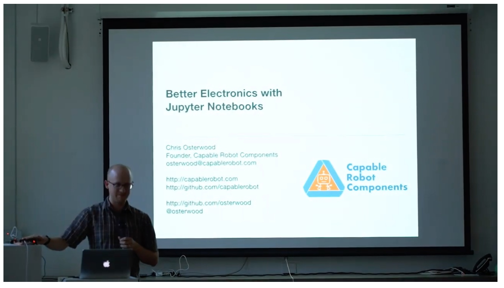

# Better Electronics with Jupyter Notebooks

These notebooks were presented by [Chris Osterwood](http://twitter.com/osterwood) at the 2019 [Crowd Supply Teardown Conference](http://crowdsupply.com/teardown/portland-2019).

A video of the presentation is available on [YouTube](https://youtu.be/DFpwlkX7V5M?t=5495).

They use the following awesome Python libraries:

|Library|Description|
|---|---|
|[Jupyter](https://jupyter.org)| The notebook runtime. |
|[Jupyter Lab](https://jupyterlab.readthedocs.io) | A new front-end to Jupyter. |
|[BqPlot](https://bqplot.readthedocs.io)| Plotting library which supports live graphs inside of Jupyter notebooks. |
|[Pint](https://pint.readthedocs.io) | Adds physical-world units to numeric objects. |
|[PySpice](https://pyspice.fabrice-salvaire.fr) | Wrapper around the SPICE electrical simulation tool. | 
|[Sympy](https://www.sympy.org) | Symbolic solver.  Used to re-order some equations in the notebooks. | 
| [PySerial](https://pythonhosted.org/pyserial/) | Allows Python to read and write to serial ports.|
|[nbconvert](https://nbconvert.readthedocs.io) | Tool which can convert & archive notebooks into static HTML and PDF documents. |

The notebooks included here are:

|Notebook|Description|
|---|---|
| USBHub\_i2c\_addresses | Used to determine address-pin settings on I2C devices to prevent address conflicts. |
| USBHub\_DC\_Regulator | Aided in the design and component selection of the 6A 5V regulator on the Capable Robot USB Hub.|
| USBHub\_Current\_Monitor | Displays live power data from the Capable Robot USB Hub and UI buttons allow per-port control of power and data lines. | 
| SenseTemp_Graph | Displays live temperature data from CapableRobot SenseTemp via a serial connection. | 
| SenseTemp\_TEC\_Filtering | Aided in the design and component selection of filters on the Capable Robot SenseTemp TEC. | 

Note these notebooks are intended to be a starting point for your own adaptation and use in your own electrical design work.  They are not designed to be general purpose tools.  

If you find these useful please let me know, and also let me know if you publish your own notebooks publicly!  I'd love to link to them and show the world more examples of notebooks aiding in product design and testing.

## Capable Robot Products

These notebooks aided in the design, development, and testing of the following Capable Robot products, which are available for purchase on Crowd Supply.

### [Programmable USB Hub](https://www.crowdsupply.com/capable-robot-components/programmable-usb-hub) 

### [SenseTemp](https://www.crowdsupply.com/capable-robot-components/sensetemp) 

### [SenseTemp TEC](https://www.crowdsupply.com/capable-robot-components/sensetemp) 

